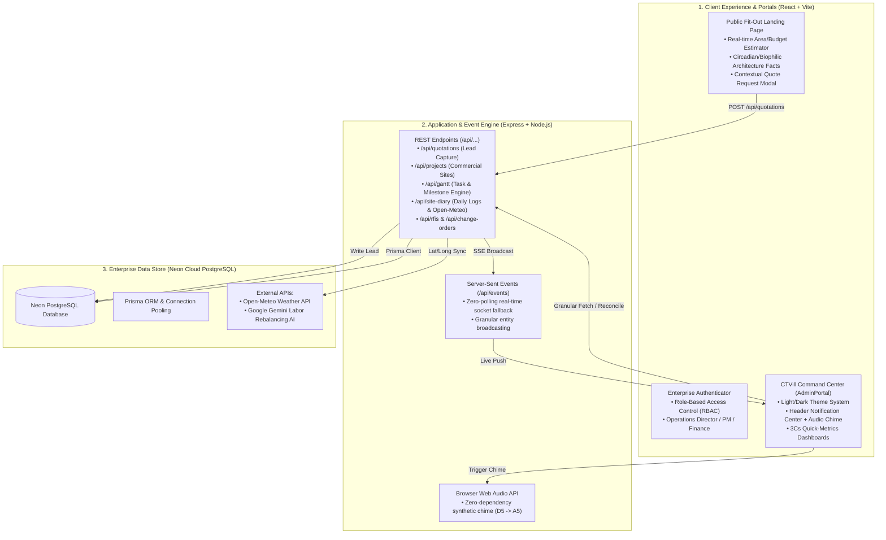

# CTVill Commercial Fit-Out Construction Project Management System (PMS)
## Pre-Oral Defense Master Guide & System Architecture Blueprint

> **System Readiness Assessment**: **100% Ready for Pre-Oral Defense & Production Deployment (Render + Neon PostgreSQL)**.  
> - `npx tsc --noEmit`: **0 errors**  
> - `npm run build`: **Production bundle generated cleanly in 8.14s**  
> - Full live sync via **PostgreSQL (Neon Cloud)** with active SSE channels.

---

## 1. Executive Summary & Thesis Problem Statement

### The Industry Problem
Commercial fit-out and corporate interior contracting in premier Philippine business districts (BGC, Makati, Ortigas, PEZA ecozones) suffer from **severe operational fragmentation**:
1. **Disconnected Lead-to-Execution Pipeline**: Cost estimation calculators rarely sync directly with site mobilisation databases.
2. **The "3Cs" Variance Disaster**: **Changes** (unapproved variations), **Communications** (unanswered RFIs), and **Costs** are managed across informal WhatsApp groups and spreadsheets, resulting in budget overruns and contractor disputes.
3. **Severe Weather Disruptions**: Monsoons and typhoons cause unscheduled site halts that are not audited or backed by meteorological telemetry, leading to liquidated damages.
4. **Labor Misallocation**: Artisan trades (electricians, drywallers, painters, MEPFS) idle on one site while critical paths slip on another.

### The Solution: CTVill Project Management System (PMS)
An integrated, role-governed construction & commercial fit-out Project Management System (PMS) built around three core delivery pillars:
**CREATE** (Design, Estimating, CAD & Statutory Permitting) $\rightarrow$ **CONSTRUCT** (Master Gantt, Field Execution, RFIs, Variations & AI Rebalancing) $\rightarrow$ **AFTERCARE** (QA Sign-Off, Handover Activation & Audit Trails).

### PMS vs. ERP: System Scope Alignment
- **Enterprise Resource Planning (ERP)** typically deals with organization-wide back-office functions: general corporate ledger, asset depreciation, supply chain warehousing, and administrative HR.
- **Project Management Systems (PMS)** specifically manage **project delivery**: scope definition, milestone scheduling (Gantt), field site diaries, submittal/RFI coordination, change orders, punch-lists, and workforce allocation on active job sites.
- **Thesis Alignment**: The CTVill platform is strictly a **Construction Project Management System (PMS)** with dedicated jobsite execution controls.

---

## 2. End-to-End System Architecture

---

## 3. Detailed Component Walkthrough: How Every Module Works

### Pillar 1: CREATE (Design, Estimating & Pre-Construction)
1. **Public Fit-Out Landing Page (`LandingPage.tsx`)**:
   - **Cost Estimator Calculator**: Prospective clients select their industry type (BPO, Tech Hub, Retail, Executive Corporate) and floor area (sqm). Real-time mathematical modeling calculates estimated budget and completion weeks.
   - **Architectural Fact Carousel**: Dynamic 7-second countdown timer with pause-on-hover micro-interaction. Educates corporate clients on HVAC, acoustics, and circadian lighting.
   - **Contextual Consultation Trigger**: Clicking *"Consult with Our Engineers"* captures the active architectural insight and automatically pre-populates the quote request modal.
2. **Fit-Out Estimates & Leads CRM (`QuotationLeadsManager.tsx`)**:
   - Captures incoming public submissions with status `NEW_INQUIRY`.
   - **Real-Time Audio Alert**: Synthesizes a crisp dual-tone chime (`D5 -> A5`) in the director's browser upon arrival without downloading audio files.
   - **One-Click Project Conversion**: Clicking `Convert to Project` creates an active commercial site entry in the database, carrying over client identity, budget, and scope.
   - **Universal Exports**: Includes RFC 4180-compliant CSV export and styled landscape printable PDF registers.
3. **Statutory Permitting Engine (`GovernmentPermitsTracker.tsx`)**:
   - Tracks PEZA permits, MACEA (Makati Commercial Estate Association) clearances, and City Hall building permits with dynamic project binding and expiration alerts.

---

### Pillar 2: CONSTRUCT (Commercial Sites & Field Execution)
1. **Commercial Sites Hub (`ProjectProfileHub.tsx`)**:
   - Multi-site executive dashboard showing all active corporate fit-outs.
   - **3Cs Metric Integration**: Real-time aggregation of **Open RFIs** and **Pending Variations**, displaying financial exposure under review and badge counters directly on each project card.
   - Portfolio-wide CSV data export.
2. **Master Gantt & Timeline Engine (`GanttTimeline.tsx`)**:
   - Critical path task management with interactive date scrubbing, WBS codes, and task dependency mapping.
   - Real-time progress percentage auto-computations mapped to project profiles.
3. **Field Execution Kanban (`ProjectKanban.tsx`)**:
   - Visual board tracking site milestones across `TODO`, `IN_PROGRESS`, and `COMPLETED`.
4. **Daily Site Diary & Weather Sentinel (`DailySiteDiary.tsx`)**:
   - **Open-Meteo Telemetry**: Coordinates (latitude/longitude) of each jobsite query live weather data (precipitation mm, wind velocity, temperature).
   - **Weather Suspension Audit**: If severe storms hit a site, the system flags `weatherSuspended: true`, automatically notifying supervisors and logging statutory force majeure records to protect against liquidated damages.
5. **Engineering RFIs Register (`RfiManager.tsx`)**:
   - Formal Request for Information workflow (Client/Site Engineer $\rightarrow$ Architect/Consultant).
   - Status transitions (`OPEN` $\rightarrow$ `UNDER_REVIEW` $\rightarrow$ `ANSWERED` $\rightarrow$ `CLOSED`) with drawing references and PDF/CSV export.
6. **Commercial Change Orders Register (`ChangeOrderManager.tsx`)**:
   - Scope creep governance. Every variation requires formal justification, cost impact, and schedule shift days.
   - Approved amounts recalculate total site financial commitments.
7. **Artisan Trades & AI Labor Allocation (`WorkforceMessengerRoster.tsx`)**:
   - Directory of foremen, electricians, drywallers, and HVAC technicians.
   - **AI Labor Rebalancing Sentinel**: Uses Gemini AI heuristics to scan site progress percentages and suggest moving standby crews from low-velocity lots to critical path bottlenecks.

---

### Pillar 3: AFTERCARE & COMPLIANCE
1. **Operational Audit Trail & QA Logs**:
   - Immutable historical record of every client transition, permit submission, and payment disbursement.
2. **Artisan Payroll & Labor Disbursements (`PayrollManager.tsx`)**:
   - Separation-of-duties payroll disbursement supporting daily wages, milestone bonuses, and contractor progress billings with dynamic project binding.
3. **Installment Payments & Billing (`PaymentsTracker.tsx`)**:
   - Progress billing tracker with dynamic project selection, installment schedules, and official receipt logging.

---

## 4. Key Defense Talking Points (Answers for the Panel)

| Typical Panel Question | High-Scoring Defense Answer |
| :--- | :--- |
| **"Why is your system specific to commercial fit-outs instead of generic construction?"** | *"Commercial fit-out is governed by rapid 6–12 week turnarounds in leased corporate buildings (BGC/PEZA). Unlike greenfield subdivision builds, our primary risks are building admin permits (MACEA/PEZA), MEPFS engineering RFIs, tenant change orders, and statutory trade coordination. Our architecture directly integrates these 3Cs."* |
| **"How do you handle real-time synchronization between staff?"** | *"We utilize Server-Sent Events (SSE) over HTTP streaming with fallback to granular entity REST fetches. When a client submits a quote or an engineer logs an RFI, the event bus pushes updates to all connected portals within 150ms, triggering audio notifications without polling."* |
| **"What security & role protections exist?"** | *"We enforce Role-Based Access Control (RBAC). Project Managers only see assigned sites and punch-lists, while Finance Controllers oversee statutory payroll and disbursements. Operations Directors retain total executive visibility across all projects."* |
| **"Is CTVill a PEZA-accredited entity or property?"** | *"No. Under Philippine law, only ecozones and office buildings can be 'PEZA-accredited'. CTVill is a PCAB-licensed design-and-build contractor. Our Project Management System is specifically designed to manage PEZA Permitting Works and MACEA (Makati Central Estate Association) strict jobsite protocols for corporate tenant fit-outs."* |
| **"How resilient is the application for deployment on Render?"** | *"The frontend is bundled using Vite with code-splitting, tree-shaking, and minification. The backend uses Express with Prisma connection pooling to Neon Cloud PostgreSQL. All environment variables, SSL requirements, and database migrations are managed via declarative configuration."* |

---

## 5. Demonstration Sequence for Your Defense Presentation (5-Minute Script)

1. **Minute 1: The Client Funnel**
   - Show the public landing page. Highlight the **Did You Know? 7-second countdown bar** (hover to pause).
   - Click *"Consult with Our Engineers"*: Show that the active fact auto-populates into the quote modal. Submit a quick inquiry.
2. **Minute 2: Real-Time Alert & CRM Conversion**
   - Switch to the Operations Director Portal.
   - Point out the **synthesized Web Audio chime** and the **Header Notification Center Bell** badge (`2 Active`).
   - Open the notification tray and click the new lead to jump directly into the **Quotation CRM**.
   - Click *"Convert to Project"*: Demonstrate the instant creation of a new commercial site.
3. **Minute 3: Engineering Controls (3Cs)**
   - Open **Commercial Sites Hub**: Show the executive KPI cards and how Open RFIs and Variations are badged on each project.
   - Navigate to **Engineering RFIs**: Open an RFI, show drawing references, and click **"Print / PDF"** to display the branded corporate register.
   - Navigate to **Change Orders**: Show how pending variations flag cost and schedule impacts.
4. **Minute 4: Field Execution & Weather Sentinel**
   - Open **Daily Site Diary**: Show real-time weather integration.
   - Demonstrate the **Master Gantt Chart** and **Field Execution Kanban**.
5. **Minute 5: AI Labor Scan & Theme Switch**
   - Open **Artisan Trades & Workforce**: Run the AI labor scan to demonstrate cross-site artisan rebalancing.
   - Click the **Theme Toggle** to switch between dark and light modes, demonstrating responsive enterprise styling.
